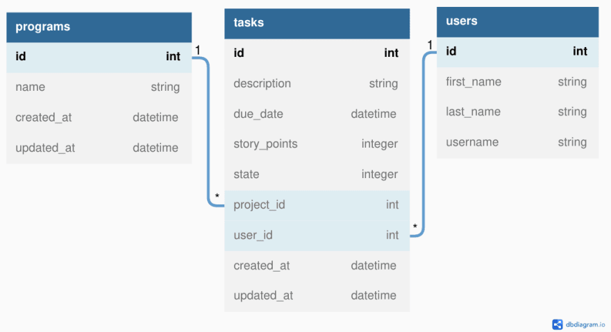

# **Scrumban Server**


[](LICENSE)

## 📖 **_Description_**

This is a Ruby server for use with the associated [React client](https://github.com/NicMortelliti/scrumban-client).

The server accepts the following HTTP requests:
| **Path** | **Request Type** | **Action** |
|------------|------------------|---------------------------------------------------------------------------------|
| / | GET | Retrieve all tasks with associated project and assigned user. |
| /users | GET | Retrieve all users. |
| /projects | GET | Retrieve all projects. |
| /tasks | GET | Retrieve all tasks. |
| /tasks | POST | Add new task to database. Then, receive the new task, user and project details. |
| /tasks/:id | PATCH | Update task matching id. Then, receive updated task, user and project details. |
| /tasks/:id | DELETE | Delete task matching id. |

### _Entity-Relationship_

The Entity-Relationship Diagram below displays the relationships between the three tables contained within the database. The tasks table is the join table, joining programs and users. The tasks table contains two foreign ID's. One points to the ID of the associated project (**_project_id_**) and the other points to ID of the associated (assigned) user (**_user_id_**). The diagram also shows that a task can only have _one_ program and _one_ user. However, both programs and users may have _many_ tasks.



---

## 🖥️ **_Install_**

### _Clone the repository_

```bash
git clone git@github.com:NicMortelliti/scrumban-server.git server
cd server
```

### _Check your Ruby version_

```properties
ruby -v
```

The output should start with something like `ruby 2.7`.

If not, install the right ruby version using [rvm](https://rvm.io/). If using a linux-based system, I highly recommend following the [installation guide](https://wiki.archlinux.org/title/RVM) from the arch wiki instead:

```properties
rvm install 2.6
```

### _Install dependencies_

Using [Bundler](https://bundler.io/):

```properties
bundle install
```

### _Initialize the database_

```properties
rake db:migrate db:seed
```

---

## 👟 **_Run_**

### _Start the server_

```properties
rake server
```

The server should now be running on `localhost:9292`.

---

## **_License_**

[MIT](https://choosealicense.com/licenses/mit/)
